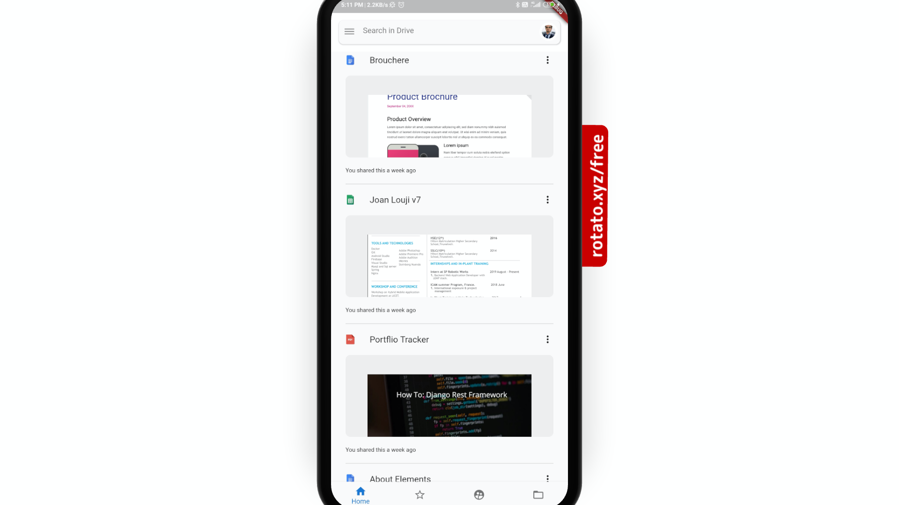
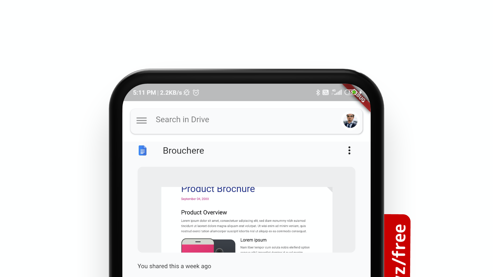

# Flutter Google Drive Clone. 

Flutter Google Drive Clone. 
This is a simple flutter application where I have cloned Google Drive UI.

## Installation

``` 
git clone 
flutter pub get
flutter run 
```


## Demo
 <br>
 <br>
 <br>
 <br>
 <br>
